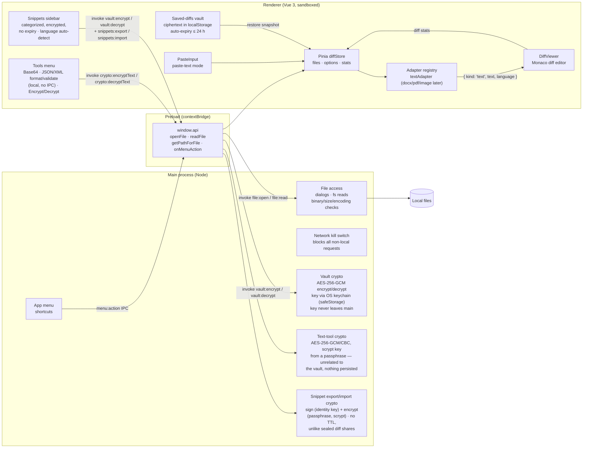

<p align="center">
  
</p>

# Diff Bro

Desktop file diff viewer (GitHub-style rendering) for Windows and macOS.
Electron + Vue 3 + Pinia + Monaco diff editor.

Features: split/unified diff with word-level highlights, paste-text mode,
diff stats, light/dark theme, live re-diff when a loaded file changes on
disk, shortcut hint bar, window-state persistence, and a saved-diffs
sidebar — saved comparisons are AES-256-GCM encrypted at rest (key held via
the OS keychain) and auto-expire after at most 24 hours. Loaded or pasted
content that looks like JSON or XML gets an inline banner offering to
pretty-print (or, if it doesn't parse, flagging that) before you diff it.

Saved diffs are organized into **categories** (a non-deletable "Default"
category always exists; saving prompts for one). Categories persist even
after their diffs expire, and are only deletable once empty. Files can be
**dragged and dropped** onto the window — two at once builds the diff, or
drop them one at a time to fill each side.

The same sidebar has a **Snippets** section below Saved/External diffs: a
personal, categorized text-snippet library (same non-deletable "Default"
category rules) — encrypted at rest like saved diffs, but with no expiry.
Each snippet's syntax can be picked explicitly (JSON, SQL, Markdown, YAML/
Kubernetes, Python, Bash, PHP, and more) or left on auto-detect, with
Monaco highlighting to match. Favorited diffs and snippets pin to the top
(snippets also appear in a pinned "★ Favorites" group). Any category (or
the whole library) can be exported as a passphrase-protected, signed
`.diffbrosnip` file for backup or moving to another machine — no recipient
key exchange needed, unlike Share Diff.

A **Tools menu** offers a few standalone local utilities that don't touch
the loaded diff: Base64 encode/decode, JSON format/validate, XML
format/validate (both with a Monaco-highlighted editor and, on error, the
exact line/column), and a passphrase-based text Encrypt/Decrypt tool
(AES-256-GCM or -CBC, key derived via scrypt — nothing is persisted,
everything stays on-machine).

On Windows and Linux the app draws its own themed menu bar (File / View /
Tools) instead of the dated native one; macOS keeps the system menu bar.
All menu accelerators work on every platform either way. Only one window
can be open at a time. It is resizable, with a 940×640 floor so the sidebar
and both diff panes stay usable.

Saved diffs can be **shared between machines** as sealed `.diffbro` files:
each file is signed (Ed25519) and then encrypted (X25519 ECDH with a fresh
ephemeral key per file + AES-256-GCM) for one selected recipient — nobody
else can read it, every file uses a different key, and any tampering
(including extending the expiry) is rejected. The Share button walks
first-time users through the one-time key exchange (keys are generated
automatically; peers swap `.diffbrokey` public-key files once in both
directions), and the signed absolute expiry means a shared diff dies
at the same moment everywhere, 24 h max.

## Development

```bash
npm install
npm run dev
npm run check   # ESLint + Vitest — run before every change lands
```

Without a local Node install, the same flow runs entirely in Docker —
`make dev` (app + noVNC) and `make check` (lint + tests); see
[`docker/README.md`](docker/README.md) and `make help`.

Tests live in `tests/`, mirroring `src/` (`tests/main/`,
`tests/renderer/{stores,utils,adapters}/`), and cover the sealing crypto
(roundtrip, tampering,
recipient binding, expiry), the vault crypto (AAD-authenticated metadata),
the Pinia stores, and the adapter registry. The crypto is deliberately split
into pure modules (`src/main/sealing.js`, `src/main/vaultCrypt.js`) so it is
unit-testable without Electron. Coding rules are in `CLAUDE.md`.

## Testing in Docker (no installer needed)

Runs the full Electron app in a container on a virtual display, viewable in
your browser:

```bash
npm run docker:up      # or: make test-env
# then open http://localhost:6080/vnc.html
```

With GNU make available, `make help` lists all shortcuts (`test-env`,
`down`, `rebuild`, `logs`, `shell`, `clean`, …).

Source is bind-mounted with hot reload; sample files to diff are in
`tests/data/`. See [docker/README.md](docker/README.md) for details.

## Packaging

Every target bundles main/preload/renderer to `build/` (via `electron-vite
build`, not electron-builder's default output dir) and then packages an
installer into `dist/`.

```bash
npm run build:win     # NSIS installer -> dist/
npm run build:mac     # DMG -> dist/            (macOS host only)
npm run build:linux   # AppImage + .deb -> dist/
```

The Windows and Linux installers can be built from the container without a
local Node install — `make package-win` and `make package-linux` run them in
an amd64 service, because electron-builder's bundled `makensis` is x86_64-only
and its NSIS steps shell out to wine. A DMG needs macOS's `hdiutil`, so
`make package-mac` is the one target that runs on the host. The DMG's window
size, icon positions and backdrop live in `electron-builder.yml`; the backdrop
itself is rendered from `resources/dmg-background.svg`.

### Windows: enable Developer Mode first

`build:win` downloads and extracts electron-builder's `winCodeSign` cache
(it bundles both mac and Windows signing tools, even for a Windows-only
build), which contains macOS `.dylib` files stored as symlinks. Creating a
symlink on Windows requires `SeCreateSymbolicLinkPrivilege`, which normal
user accounts don't have unless Developer Mode is on — without it the build
fails with `Cannot create symbolic link: A required privilege is not held
by the client.`

Enable it once via **Settings → Privacy & security → For developers →
Developer Mode**, then re-run the build. No admin/elevation needed
afterward, and it's a one-time machine setting. If a build already failed
partway through, delete the partial cache first so it re-extracts cleanly:

```powershell
Remove-Item -Recurse -Force "$env:LOCALAPPDATA\electron-builder\Cache\winCodeSign"
```

### Releasing

Pushing a tag matching `v*.*.*` runs
[`.github/workflows/release.yml`](.github/workflows/release.yml): lint +
tests, then `build:win` and `build:mac` in parallel on GitHub-hosted Windows
and macOS runners, and attaches both installers to a GitHub Release for that
tag. Builds are unsigned (no code-signing cert / Apple Developer account yet
— see `DEVELOPMENT_PLAN.md` Phase 3), and there is deliberately no
auto-update — installers are the only distribution path.

```bash
git tag v0.1.0 && git push origin v0.1.0
```

## Architecture



Key rules encoded in that picture:

- **All file access happens in the main process.** The renderer never touches
  Node or the filesystem; it only calls the small `window.api` surface.
- **Adapters decouple formats from viewers.** Everything is normalized into a
  comparable (`{ kind, ... }`); future docx/pdf/image adapters plug into the
  registry without touching `DiffViewer`.
- **The network kill switch guarantees offline operation** — every request
  that isn't `file://`/`devtools://`/`blob:`/`data:` (or the Vite dev server
  in dev mode) is cancelled at the session level.

### Directory map

- `src/main` – Electron main process: window (single-instance, fixed size),
  app menu, file dialogs, fs reads with binary detection, large-file
  confirmation, encoding detection (`chardet` + `iconv-lite`), `textCrypt.js`
  (pure, unit-tested passphrase encrypt/decrypt for the Tools menu), and
  `snippetSealing.js` (pure, signed + passphrase-encrypted snippet
  export/import, no TTL — separate from `sealing.js`'s 24 h-capped shares).
- `src/preload` – `contextBridge` API: `openFile`, `readFile`, `getPathForFile`
  (drag & drop path resolution, required on Electron >= 32), `onMenuAction`.
- `src/renderer` – Vue app.
  - `adapters/` – converts a raw file into comparable content. `textAdapter`
    is the fallback; future `docxAdapter`, `pdfAdapter`, `imageAdapter` plug in
    here without touching the viewer.
  - `stores/diffStore.js` – Pinia: selected files, view options, paste-text
    state, diff stats, menu-action dispatch.
  - `components/DiffViewer.vue` – Monaco diff editor wrapper (+ diff stats).
  - `components/PasteInput.vue` – two-textarea paste-text mode.
  - `components/FormatHintBanner.vue` – "looks like JSON/XML" suggestion,
    shown above the diff editor.
  - `components/Base64Dialog.vue`, `JsonToolDialog.vue`, `XmlToolDialog.vue`,
    `EncryptDecryptDialog.vue` – standalone Tools menu utilities.
  - `utils/textFormats.js`, `utils/base64.js` – pure detect/validate/format
    helpers behind the banner and the Base64/JSON/XML tools (no IPC needed;
    everything runs in the renderer).
  - `stores/snippetStore.js`, `components/SnippetsPanel.vue`,
    `SnippetEditorDialog.vue`, `SnippetPassphraseDialog.vue`,
    `utils/detectLanguage.js` – the Snippets sidebar: categorized text
    snippets encrypted with the same vault key as saved diffs (no expiry),
    Monaco-highlighted editor with best-effort JSON/SQL/Markdown/plaintext
    detection, and passphrase-protected + signed export/import.
- `docker/` – containerized test environment (Xvfb + noVNC), see
  [docker/README.md](docker/README.md).

See `DEVELOPMENT_PLAN.md` for the roadmap.
