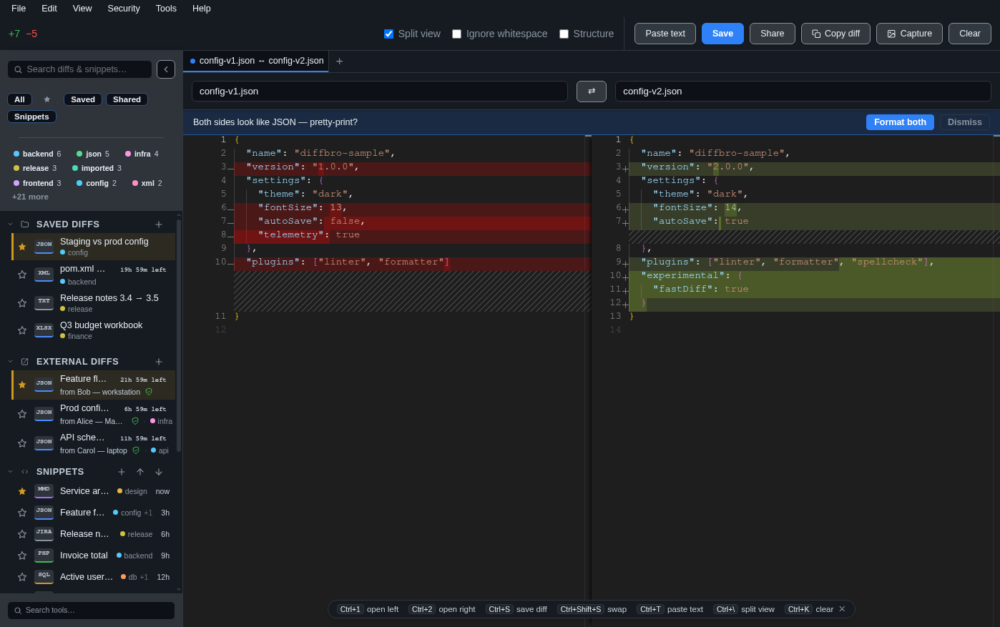
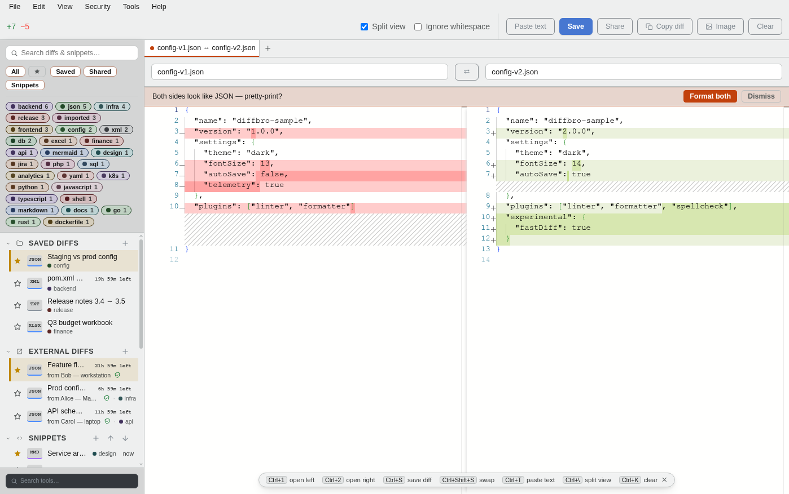
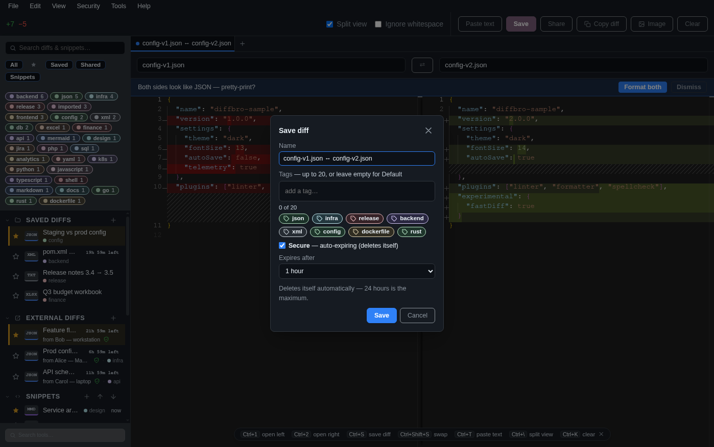

<p align="center">
  
</p>

# Diff Bro

An **offline-only** desktop diff viewer for Windows and macOS — GitHub-style
rendering, serious about privacy. Electron + Vue 3 + Pinia + Monaco.

It never makes a network request: files stay on your machine, enforced by a
session-level kill-switch, a strict CSP, and a sandboxed renderer. See
[docs/security.md](docs/security.md).

<p align="center">
  
</p>

## Download

Grab the latest installer for your OS — no account, no telemetry, no auto-update:

| OS | Download |
| --- | --- |
| **Windows** (10/11) | [**Diff-Bro-Setup-Windows.exe**](https://github.com/mindaugaskasp/diff-bro/releases/latest/download/Diff-Bro-Setup-Windows.exe) |
| **macOS** | [**Diff-Bro-macOS.dmg**](https://github.com/mindaugaskasp/diff-bro/releases/latest/download/Diff-Bro-macOS.dmg) |

Or browse [**all releases**](https://github.com/mindaugaskasp/diff-bro/releases/latest).

Builds are **unsigned** for now (no Apple/Microsoft cert yet):

- **Windows** — SmartScreen warns; click **More info → Run anyway**.
- **macOS** — Gatekeeper says *"Diff Bro is damaged and can't be opened."* It
  isn't damaged — that's just how recent macOS reports an unsigned,
  un-notarized app that was quarantined on download. Drag it to **Applications**,
  then run once in Terminal:

  ```bash
  xattr -dr com.apple.quarantine "/Applications/Diff Bro.app"
  ```

  and open it normally. More detail in [docs/packaging.md](docs/packaging.md).

## Features

- **Diff** two files or pasted text — split/inline, word-level highlights,
  syntax highlighting, live re-diff when a file changes on disk, and an in-view
  search (plain / regex, match count, jump-to-match).
- **Drag & drop** files onto the window (two at once builds the diff; a third
  starts over). Fixed, single window; light/dark themes; clamped zoom.
- **Saved diffs** — AES-256-GCM encrypted at rest, auto-expiring (≤ 24 h),
  organized into categories, favoritable.
- **Share** a saved diff as a sealed, signed `.diffbro` file for one recipient;
  manage named trusted keys under the **Security** menu.
- **Snippets** — an encrypted, categorized, non-expiring text library with
  per-snippet syntax (JSON / SQL / Markdown / YAML / Python / Bash / PHP / …),
  filter + copy, and passphrase-protected export/import.
- **Tools** — Base64, and JSON / XML / SQL format+validate (Monaco-highlighted,
  with "Add to Snippets"), plus a passphrase text Encrypt/Decrypt.
- **Config backup/restore** — one passphrase-encrypted file for your keys,
  trusted hosts, snippets and settings (not diffs).

JSON/XML content shows an inline "pretty-print it?" banner before you diff.

## Screenshots

<table>
  <tr>
    <td width="50%" valign="top">
      
      <p align="center"><em>Light and dark themes, GitHub-style rendering.</em></p>
    </td>
    <td width="50%" valign="top">
      
      <p align="center"><em>Saved diffs are encrypted on-device and auto-expire.</em></p>
    </td>
  </tr>
</table>

## Quick start

```bash
npm install
npm run dev
npm run check   # ESLint + Vitest — run before every change lands
```

No local Node? The same flow runs in Docker: `make dev` (app via noVNC at
<http://localhost:6080/vnc.html>) and `make check`. See
[docker/README.md](docker/README.md) and `make help`.

## Docs

- [Architecture](docs/architecture.md) — processes, trust boundary, directory map.
- [Security model](docs/security.md) — offline guarantee, sharing, keys, backup.
- [Packaging & releasing](docs/packaging.md) — installers, signing notes, CI.
- Coding standards and hard rules live in [CLAUDE.md](CLAUDE.md); roadmap in
  [DEVELOPMENT_PLAN.md](DEVELOPMENT_PLAN.md).
