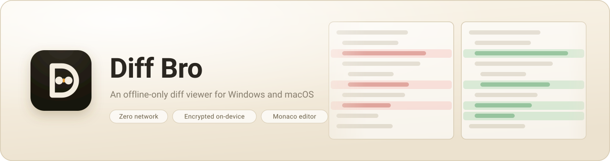
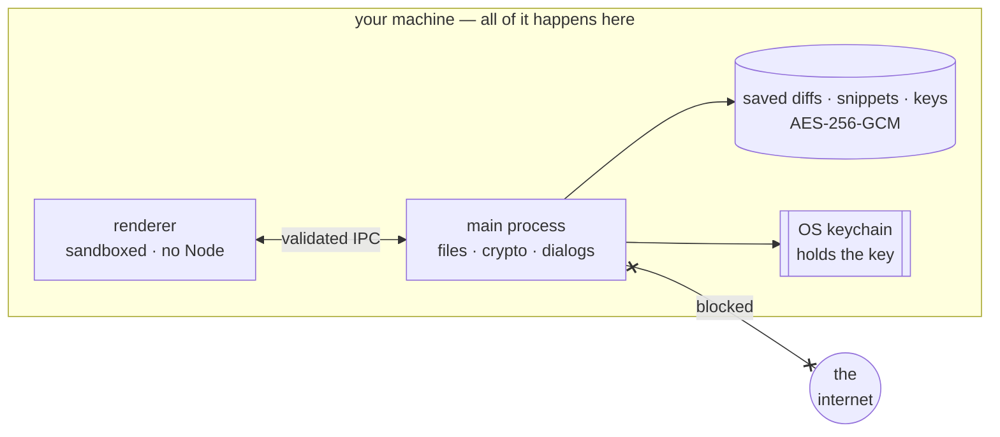

<p align="center">
  <picture>
    <source media="(prefers-color-scheme: dark)" srcset="docs/brand/hero-dark.svg">
    
  </picture>
</p>

<p align="center">
  <b>Stop pasting production configs into an online diff tool.</b><br>
  Compare two files, keep the ones worth keeping, and hand one to a teammate
  sealed —<br>with no account, no telemetry and not one network request.
</p>

<p align="center">
  <a href="#install">Install</a> ·
  <a href="#what-it-does">What it does</a> ·
  <a href="#offline-by-construction">Offline by construction</a> ·
  <a href="#build-from-source">Build</a> ·
  <a href="#docs">Docs</a>
</p>

<p align="center">
  
</p>

## Install

| OS                            | Get it                                                                                             |
| ----------------------------- | -------------------------------------------------------------------------------------------------- |
| **Windows** 10/11             | [`diff-bro-Setup-v<version>.exe`](https://github.com/mindaugaskasp/diff-bro/releases/latest)       |
| **macOS** 12+ (Apple silicon) | [`diff-bro-v<version>.dmg`](https://github.com/mindaugaskasp/diff-bro/releases/latest) or Homebrew |

```bash
brew tap mindaugaskasp/tap
brew install --cask diff-bro
xattr -dr com.apple.quarantine "/Applications/Diff Bro.app"
```

Builds are **unsigned**, so SmartScreen and Gatekeeper warn on first launch (the
`xattr` line clears it on macOS) — see [packaging](docs/packaging.md).

## What it does

|                          |                                                                                                                                                                                                                                                                                                                                                                                                                                                                                                                    |
| ------------------------ | ------------------------------------------------------------------------------------------------------------------------------------------------------------------------------------------------------------------------------------------------------------------------------------------------------------------------------------------------------------------------------------------------------------------------------------------------------------------------------------------------------------------ |
| **Compare**              | Two files or pasted text, split or inline, word-level highlights, in-view search, and a live re-diff when a file changes on disk.                                                                                                                                                                                                                                                                                                                                                                                  |
| **Understand structure** | JSON, YAML and XML compared as _data_: reordering keys or reformatting stops counting, and unchanged keys collapse away.                                                                                                                                                                                                                                                                                                                                                                                           |
| **Excel**                | `.xlsx` workbooks as aligned grids — sheet tabs and cell-level highlights, with inserted rows and columns that don't cascade into false changes. Dates read as dates, hidden sheets and rows are marked, and formulas are compared as well as their results, so a total pasted over the formula behind it is caught rather than shown as unchanged. Set a tolerance — one of the presets or a threshold of your own, percentage or raw — and rounding noise stops counting; export the whole change list as a CSV. |
| **CSV**                  | `.csv` and `.tsv` compare as text or, one toggle away, as the same grid — rows aligned by their first column, quoted fields kept whole.                                                                                                                                                                                                                                                                                                                                                                            |
| **Huge files**           | Past 32 MB a file is indexed by line instead of loaded, and the rows you're looking at are read from disk as you scroll — a multi-gigabyte log opens in seconds. Marked as streamed, with the few actions that need the whole text saying so rather than half-working.                                                                                                                                                                                                                                             |
| **Keep**                 | Saved diffs: encrypted, tagged, optionally auto-expiring. Your open tabs come back on the next launch.                                                                                                                                                                                                                                                                                                                                                                                                             |
| **Share**                | One signed file only the recipients you ticked can open, carrying the expiry you chose so every copy dies at the same moment.                                                                                                                                                                                                                                                                                                                                                                                      |
| **Export as image**      | A real screenshot of the diff view — your theme, panes and highlighting — cropped to the change and stitched if it's taller than the window. Snippets go the same way, and a Mermaid snippet leaves as its rendered diagram.                                                                                                                                                                                                                                                                                       |
| **Snippets**             | An encrypted, tagged text library you can drag straight into the diff pane — two snippets compare like any two files, and editing one updates the comparison on screen. Per-language highlighting, live Mermaid (readable light or dark whatever the app is wearing), Markdown/Jira preview, and secret snippets that render as `****`.                                                                                                                                                                            |
| **Quick look-up**        | A global shortcut searches your snippets and diffs without raising the app; copy one straight to the clipboard.                                                                                                                                                                                                                                                                                                                                                                                                    |
| **Tools**                | JSON, Base64, UUID, JWT, Epoch, URL, Lines, XML, checksums, a regex tester, find & replace, text encryption — rich panels, not blank text boxes.                                                                                                                                                                                                                                                                                                                                                                   |
| **Terminal**             | `diffbro compare a.json b.json` opens a comparison in the running app, `diffbro open` raises it, `diffbro backup <path>` writes an encrypted archive. No port, no daemon.                                                                                                                                                                                                                                                                                                                                          |
| **Yours to arrange**     | Fourteen themes (Nord, Sepia, Solar, Nyan, Matrix, plus accessibility-grade Contrast and Beacon), shared tags, adjustable limits.                                                                                                                                                                                                                                                                                                                                                                                  |

<details>
<summary>The smaller things</summary>

- **Drag & drop** files onto the window; it warns before discarding unsaved work.
- **Ctrl/Cmd+V** pastes straight into a comparison — including pasted text against a real file.
- **Copy diff** puts a git-style unified patch on the clipboard.
- **Quick look-up keys** — ↑/↓ browse, **→** steps into a preview or the tools, **←** steps back out, **Enter** opens, **+** captures a plaintext snippet without raising the app.
- **Resizable dialogs** — the snippet editor and tool windows resize from any edge and remember their size; existing snippets open read-only until you press Edit.
- **Save a tool's output** — anything a tool produced goes straight into the snippet library from its own window; you supply the name, the app fills the rest.
- **Uniform snippet names** — every name is sentence-cased on save, so a library grown over months still reads consistently.
- **Repair a pasted diagram** — Mermaid copied out of Word or Confluence arrives with `—>` where `-->` was, curly quotes and non-breaking spaces; **Repair** in the snippet editor puts them all back.
- **More terminal commands** — `diffbro open [<file>]` brings the app to the front (with a file, it fills the left side and waits for the right), `diffbro backup <path>` seals everything you have into a zip at a path you choose, `diffbro create snippet` opens a new snippet, `diffbro cb save` keeps what you just copied, and `diffbro help <command>` explains one. A second launch hands its arguments to the running window through Electron's single-instance lock.
- **The tools in full** — JSON (pretty/minify/sort, JSONPath filter, collapsible tree), Base64 (URL-safe, MIME wrap), UUID (v1/v4/v5/v6/v7, inspect, convert), JWT, Epoch, URL (editable query-param table), Lines (split, sort, dedupe, build a SQL `IN (…)` list), XML format + validate, find & replace, and AES-256-GCM passphrase encryption with an opt-in raw-key CBC decrypt for external payloads.

</details>

## Offline by construction



- **Zero network** — a session-level kill switch, a strict CSP, a deny-all
  permission handler and a blocked `will-navigate`, not just a promise.
- **Encrypted at rest** — AES-256-GCM, the key held by your OS keychain, and
  never handed to the renderer.
- **Sealed sharing** — sign-then-encrypt, bound to the exact recipient set, with
  an expiry capped at one week. Details in the [security model](docs/security.md).

## A look around

<table>
  <tr>
    <td width="50%" valign="top">
      
      <p align="center"><em>Excel workbooks as aligned grids.</em></p>
    </td>
    <td width="50%" valign="top">
      
      <p align="center"><em>Fourteen themes, GitHub-style rendering.</em></p>
    </td>
  </tr>
  <tr>
    <td width="50%" valign="top">
      
      <p align="center"><em>Saved diffs are encrypted and auto-expire.</em></p>
    </td>
    <td width="50%" valign="top">
      
      <p align="center"><em>Drop or choose two files of any text format.</em></p>
    </td>
  </tr>
</table>

## Build from source

Needs **Node 22.12+** — the version Docker and CI use.

```bash
nvm use          # or install Node 22.12+ yourself
npm install
npm run dev      # run it
npm run check    # lint + tests
```

No local Node? The same flow runs in Docker: `make dev`, `make check`, `make e2e`
(see [docker/README.md](docker/README.md) and `make help`).

Electron · Vue 3 · Pinia · Monaco. New formats plug in through the adapter
registry rather than into the viewer.

## Docs

| Doc                                    | What's in it                                        |
| -------------------------------------- | --------------------------------------------------- |
| [Architecture](docs/architecture.md)   | Processes, trust boundary, directory map            |
| [IPC & security](docs/ipc-security.md) | How renderer↔main talk, and what the sandbox blocks |
| [Security model](docs/security.md)     | Offline guarantee, sharing, keys, backup            |
| [Packaging](docs/packaging.md)         | Installers, signing notes, CI                       |
| [Chocolatey](docs/chocolatey.md)       | Plan + package skeleton for `choco install diffbro` |
| [Glossary](docs/glossary.md)           | Every term and abbreviation (IPC, CSP, GCM, …)      |
| [Standards](docs/standards.md)         | Coding standards and the rules the build enforces   |

## License

[Mozilla Public License 2.0](LICENSE) — use it commercially and link it into
proprietary code; changes to Diff Bro's own files stay open.
