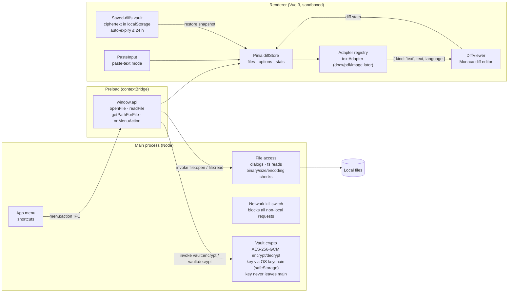

<p align="center">
  
</p>

# DiffBro

Desktop file diff viewer (GitHub-style rendering) for Windows and macOS.
Electron + Vue 3 + Pinia + Monaco diff editor.

Features: split/unified diff with word-level highlights, paste-text mode,
diff stats, light/dark theme, live re-diff when a loaded file changes on
disk, shortcut hint bar, window-state persistence, and a saved-diffs
sidebar — saved comparisons are AES-256-GCM encrypted at rest (key held via
the OS keychain) and auto-expire after at most 24 hours.

On Windows and Linux the app draws its own themed menu bar (File / View)
instead of the dated native one; macOS keeps the system menu bar. All menu
accelerators work on every platform either way.

Saved diffs can be **shared between machines** as sealed `.diffbro` files:
each file is signed (Ed25519) and then encrypted (X25519 ECDH with a fresh
ephemeral key per file + AES-256-GCM) for one selected recipient — nobody
else can read it, every file uses a different key, and any tampering
(including extending the expiry) is rejected. The Share button walks
first-time users through the one-time key exchange (keys are generated
automatically; peers swap `.diffbrokey` public-key files once in both
directions), and the signed absolute expiry means a shared diff dies
at the same moment everywhere, 24 h max.

## Development

```bash
npm install
npm run dev
npm run check   # ESLint + Vitest — run before every change lands
```

Tests live in `tests/` and cover the sealing crypto (roundtrip, tampering,
recipient binding, expiry), the vault crypto (AAD-authenticated metadata),
the Pinia stores, and the adapter registry. The crypto is deliberately split
into pure modules (`src/main/sealing.js`, `src/main/vaultCrypt.js`) so it is
unit-testable without Electron. Coding rules are in `CLAUDE.md`.

## Testing in Docker (no installer needed)

Runs the full Electron app in a container on a virtual display, viewable in
your browser:

```bash
npm run docker:up      # or: make test-env
# then open http://localhost:6080/vnc.html
```

With GNU make available, `make help` lists all shortcuts (`test-env`,
`down`, `rebuild`, `logs`, `shell`, `clean`, …).

Source is bind-mounted with hot reload; sample files to diff are in
`testdata/`. See [docker/README.md](docker/README.md) for details.

## Packaging

Both targets bundle main/preload/renderer to `build/` (via `electron-vite
build`, not electron-builder's default output dir) and then package an
installer into `dist/`.

```bash
npm run build:win   # NSIS installer -> dist/  (run on Windows; make package-win)
npm run build:mac   # DMG -> dist/              (must run on macOS; make package-mac)
```

electron-builder can't cross-package a mac installer from Windows or vice
versa — build each target on that OS.

### Windows: enable Developer Mode first

`build:win` downloads and extracts electron-builder's `winCodeSign` cache
(it bundles both mac and Windows signing tools, even for a Windows-only
build), which contains macOS `.dylib` files stored as symlinks. Creating a
symlink on Windows requires `SeCreateSymbolicLinkPrivilege`, which normal
user accounts don't have unless Developer Mode is on — without it the build
fails with `Cannot create symbolic link: A required privilege is not held
by the client.`

Enable it once via **Settings → Privacy & security → For developers →
Developer Mode**, then re-run the build. No admin/elevation needed
afterward, and it's a one-time machine setting. If a build already failed
partway through, delete the partial cache first so it re-extracts cleanly:

```powershell
Remove-Item -Recurse -Force "$env:LOCALAPPDATA\electron-builder\Cache\winCodeSign"
```

### Releasing

Pushing a tag matching `v*.*.*` runs
[`.github/workflows/release.yml`](.github/workflows/release.yml): lint +
tests, then `build:win` and `build:mac` in parallel on GitHub-hosted Windows
and macOS runners, and attaches both installers to a GitHub Release for that
tag. Builds are unsigned (no code-signing cert / Apple Developer account yet
— see `DEVELOPMENT_PLAN.md` Phase 3), and there is deliberately no
auto-update — installers are the only distribution path.

```bash
git tag v0.1.0 && git push origin v0.1.0
```

## Architecture



Key rules encoded in that picture:

- **All file access happens in the main process.** The renderer never touches
  Node or the filesystem; it only calls the small `window.api` surface.
- **Adapters decouple formats from viewers.** Everything is normalized into a
  comparable (`{ kind, ... }`); future docx/pdf/image adapters plug into the
  registry without touching `DiffViewer`.
- **The network kill switch guarantees offline operation** — every request
  that isn't `file://`/`devtools://`/`blob:`/`data:` (or the Vite dev server
  in dev mode) is cancelled at the session level.

### Directory map

- `src/main` – Electron main process: window, app menu, file dialogs, fs reads
  with binary detection, large-file confirmation, and encoding detection
  (`chardet` + `iconv-lite`).
- `src/preload` – `contextBridge` API: `openFile`, `readFile`, `getPathForFile`
  (drag & drop path resolution, required on Electron >= 32), `onMenuAction`.
- `src/renderer` – Vue app.
  - `adapters/` – converts a raw file into comparable content. `textAdapter`
    is the fallback; future `docxAdapter`, `pdfAdapter`, `imageAdapter` plug in
    here without touching the viewer.
  - `stores/diffStore.js` – Pinia: selected files, view options, paste-text
    state, diff stats, menu-action dispatch.
  - `components/DiffViewer.vue` – Monaco diff editor wrapper (+ diff stats).
  - `components/PasteInput.vue` – two-textarea paste-text mode.
- `docker/` – containerized test environment (Xvfb + noVNC), see
  [docker/README.md](docker/README.md).

See `DEVELOPMENT_PLAN.md` for the roadmap.
