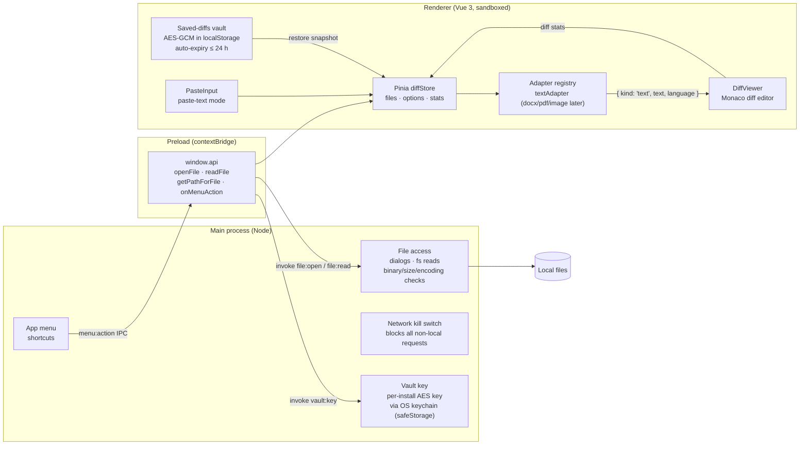

# DiffBro

Desktop file diff viewer (GitHub-style rendering) for Windows and macOS.
Electron + Vue 3 + Pinia + Monaco diff editor.

Features: split/unified diff with word-level highlights, paste-text mode,
diff stats, shortcut hint bar, and a saved-diffs sidebar — saved comparisons
are AES-256-GCM encrypted at rest (key held via the OS keychain) and
auto-expire after at most 24 hours.

Saved diffs can be **shared between machines** as Ed25519-signed `.diffbro`
files: the receiver imports the sender's public key once (File → Add
Trusted Key), unknown or tampered files are rejected, and the signed
absolute expiry means a shared diff dies at the same moment everywhere.

## Development

```bash
npm install
npm run dev
```

## Testing in Docker (no installer needed)

Runs the full Electron app in a container on a virtual display, viewable in
your browser:

```bash
npm run docker:up      # or: make test-env
# then open http://localhost:6080/vnc.html
```

With GNU make available, `make help` lists all shortcuts (`test-env`,
`down`, `rebuild`, `logs`, `shell`, `clean`, …).

Source is bind-mounted with hot reload; sample files to diff are in
`testdata/`. See [docker/README.md](docker/README.md) for details.

## Packaging

```bash
npm run build:win   # NSIS installer -> dist/
npm run build:mac   # DMG -> dist/ (run on macOS)
```

## Architecture



Key rules encoded in that picture:

- **All file access happens in the main process.** The renderer never touches
  Node or the filesystem; it only calls the small `window.api` surface.
- **Adapters decouple formats from viewers.** Everything is normalized into a
  comparable (`{ kind, ... }`); future docx/pdf/image adapters plug into the
  registry without touching `DiffViewer`.
- **The network kill switch guarantees offline operation** — every request
  that isn't `file://`/`devtools://`/`blob:`/`data:` (or the Vite dev server
  in dev mode) is cancelled at the session level.

### Directory map

- `src/main` – Electron main process: window, app menu, file dialogs, fs reads
  with binary detection, large-file confirmation, and encoding detection
  (`chardet` + `iconv-lite`).
- `src/preload` – `contextBridge` API: `openFile`, `readFile`, `getPathForFile`
  (drag & drop path resolution, required on Electron >= 32), `onMenuAction`.
- `src/renderer` – Vue app.
  - `adapters/` – converts a raw file into comparable content. `textAdapter`
    is the fallback; future `docxAdapter`, `pdfAdapter`, `imageAdapter` plug in
    here without touching the viewer.
  - `stores/diffStore.js` – Pinia: selected files, view options, paste-text
    state, diff stats, menu-action dispatch.
  - `components/DiffViewer.vue` – Monaco diff editor wrapper (+ diff stats).
  - `components/PasteInput.vue` – two-textarea paste-text mode.
- `docker/` – containerized test environment (Xvfb + noVNC), see
  [docker/README.md](docker/README.md).

See `DEVELOPMENT_PLAN.md` for the roadmap.
