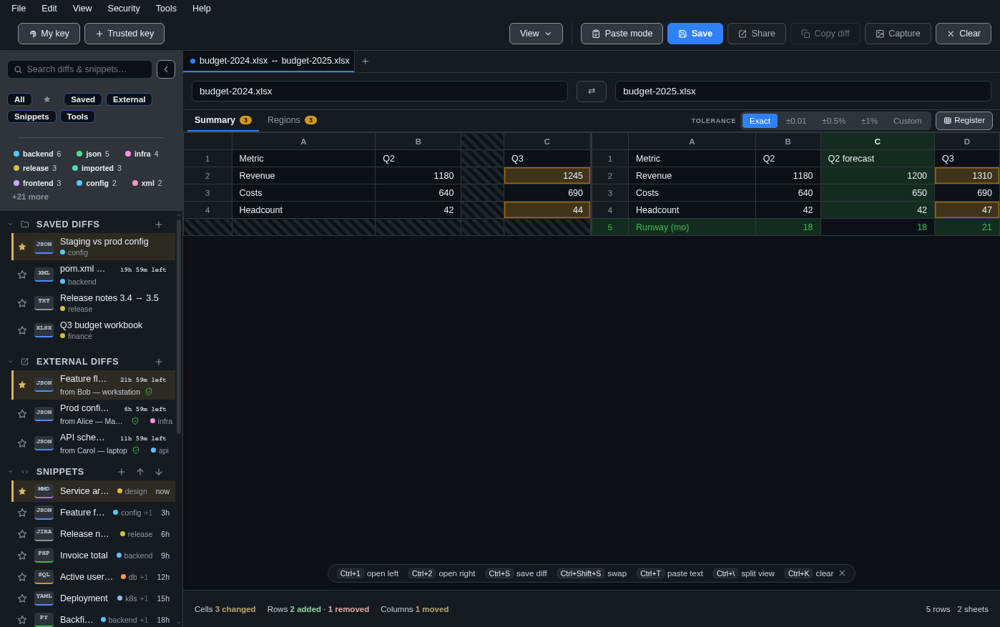
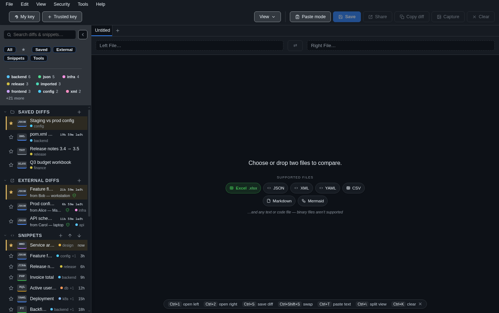

<p align="center">
  
</p>

# Diff Bro

**An offline-only desktop diff viewer for Windows and macOS.** GitHub-style
side-by-side comparison, syntax highlighting, and encrypted local history — with
a hard promise: it never touches the network.

<p align="center">
  
</p>

## Why Diff Bro

- **Truly offline.** No account, no telemetry, no auto-update, no CDN. The app
  makes *zero* network requests — enforced by a session-level kill switch, a
  strict CSP, and a sandboxed renderer, not just a promise. Your files never
  leave your machine.
- **Private by default.** Anything you keep — saved diffs, snippets, keys — is
  encrypted on-device (AES-256-GCM), with the key held by your OS keychain.
  Saved diffs auto-expire.
- **Fast and familiar.** The Monaco editor that powers VS Code, with GitHub-style
  rendering you already know.

## Features

- **Diff** two files or pasted text — split or inline, word-level highlights,
  syntax highlighting, in-view search, and a live re-diff when a file changes on
  disk. Copy the result as a git-style unified patch.
- **Excel (.xlsx) comparison** — a structured **grid** diff with sheet tabs and
  cell / row-level highlighting, aligned so an inserted row doesn't cascade.
  Parsed entirely offline by a small custom reader (no heavyweight dependency).
- **Paste mode** for quick throwaway comparisons, including pasted text against a
  real file — or just hit **Ctrl/Cmd+V** to paste straight into a comparison.
- **Drag & drop** files onto the window; it warns before discarding unsaved work.
- **Saved diffs** — encrypted, optionally auto-expiring, and tagged.
- **Share** a diff as a sealed, signed file only its intended recipient can open.
- **Snippets** — an encrypted, tagged text library with per-language
  highlighting and live **Mermaid** diagram rendering, in a viewer you can drag
  bigger from any corner (and that fills the window when the app goes fullscreen).
- **Tools** — Base64, JSON / XML / SQL format + validate, find & replace
  (characters, words, or regex), and passphrase text encryption.
- **Yours to arrange** — eight themes (incl. Nord, Sepia, and a playful Nyan with
  a reward cat), one tag namespace shared across diffs and snippets, a sidebar
  that filters by section and tag, and adjustable limits, all remembered between
  sessions.

<p align="center">
  
  <br><em>Excel (.xlsx) files compared as aligned grids — changed cells boxed, added/removed rows aligned.</em>
</p>

<table>
  <tr>
    <td width="50%" valign="top">
      
      <p align="center"><em>Light and dark themes, GitHub-style rendering.</em></p>
    </td>
    <td width="50%" valign="top">
      
      <p align="center"><em>Saved diffs are encrypted on-device and auto-expire.</em></p>
    </td>
  </tr>
  <tr>
    <td width="50%" valign="top">
      
      <p align="center"><em>Drop or choose two files — Excel, JSON/XML, or any text.</em></p>
    </td>
    <td width="50%" valign="top"></td>
  </tr>
</table>

## Download

Grab the latest installer from the
[**latest release**](https://github.com/mindaugaskasp/diff-bro/releases/latest):

| OS | Download |
| --- | --- |
| **Windows** (10/11) | `diff-bro-Setup-v<version>.exe` |
| **macOS** (Apple silicon, 12+) | `diff-bro-v<version>.dmg` |

**macOS via Homebrew:**

```bash
brew tap mindaugaskasp/tap
brew install --cask diff-bro
xattr -dr com.apple.quarantine "/Applications/Diff Bro.app"
```

Builds are currently **unsigned**, so Windows SmartScreen and macOS Gatekeeper
will warn on first launch (the `xattr` line above clears it on macOS). Full
details in [docs/packaging.md](docs/packaging.md).

## Tech

Electron · Vue 3 · Pinia · Monaco. Text first, with an adapter registry for
richer formats to come. Security and offline guarantees are non-negotiable — see
the [security model](docs/security.md).

## Build from source

```bash
npm install
npm run dev      # run locally
npm run check    # lint + tests
```

No local Node? The same flow runs in Docker: `make dev`, `make check`,
`make e2e`. See [docker/README.md](docker/README.md) and `make help`.

## Docs

- [Architecture](docs/architecture.md) — processes, trust boundary, directory map.
- [IPC & security](docs/ipc-security.md) — how renderer↔main talk, and what the
  sandbox blocks (with diagrams).
- [Security model](docs/security.md) — offline guarantee, sharing, keys, backup.
- [Packaging & releasing](docs/packaging.md) — installers, signing notes, CI.
- [Chocolatey release](docs/chocolatey.md) — plan + package skeleton for
  `choco install diffbro`.
- [Glossary](docs/glossary.md) — every term and abbreviation (IPC, CSP, GCM, …).
- Coding standards live in [CLAUDE.md](CLAUDE.md); roadmap in
  [DEVELOPMENT_PLAN.md](DEVELOPMENT_PLAN.md).
