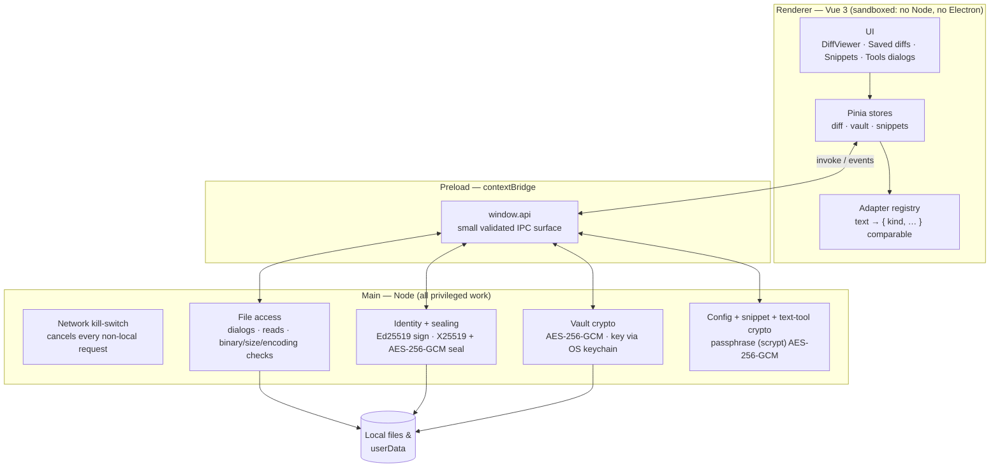

# Architecture

Three processes with a hard trust boundary: the **renderer** is sandboxed and
never touches Node or Electron; everything privileged (filesystem, dialogs,
crypto, keys) lives in **main**; the **preload** exposes only a small, validated
`window.api` IPC surface between them.

### Rules encoded in that picture

- **All file access and crypto happen in main.** The renderer only calls the
  small `window.api` surface; keys never cross the IPC boundary.
- **Adapters decouple formats from viewers.** Everything is normalized into a
  comparable (`{ kind, … }`); new formats plug into the registry without
  touching `DiffViewer`.
- **The network kill-switch guarantees offline operation** — every request that
  isn't `file://` / `devtools://` / `blob:` / `data:` (or the Vite dev server in
  dev mode) is cancelled at the session level.

### Directory map

- `src/main` — Electron main: window, menu, file dialogs + reads (binary/size
  detection, `chardet`/`iconv-lite` encoding), and the pure, unit-tested crypto
  cores: `sealing.js` (sealed diff sharing), `vaultCrypt.js` (saved-diff vault),
  `snippetSealing.js` (snippet export), `textCrypt.js` (Tools encrypt/decrypt),
  `configBackup.js` (config backup). `share.js` is the thin Electron glue.
- `src/preload` — the `contextBridge` `window.api`.
- `src/renderer` — the Vue app: `adapters/`, `stores/` (Pinia), and
  `components/` (viewer, sidebar, dialogs), plus pure `utils/`
  (`textFormats`, `sqlFormat`, `base64`, `detectLanguage`).
- `docs/` — this file, plus [security.md](security.md) and
  [packaging.md](packaging.md).
- `tests/` — mirrors `src/` (`tests/main`, `tests/renderer/{stores,utils,adapters}`).

See [DEVELOPMENT_PLAN.md](../DEVELOPMENT_PLAN.md) for the roadmap.
