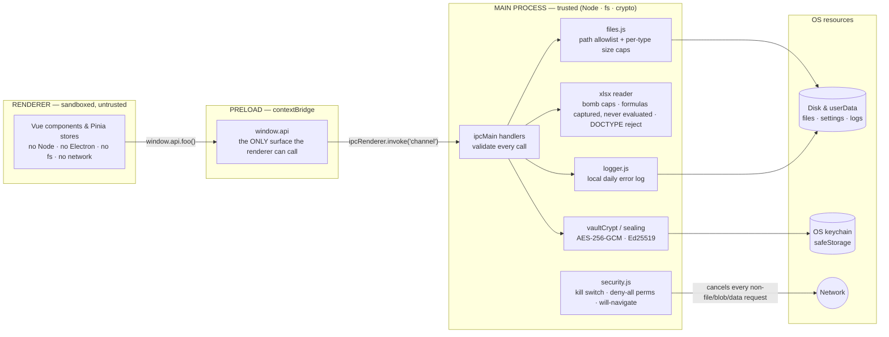
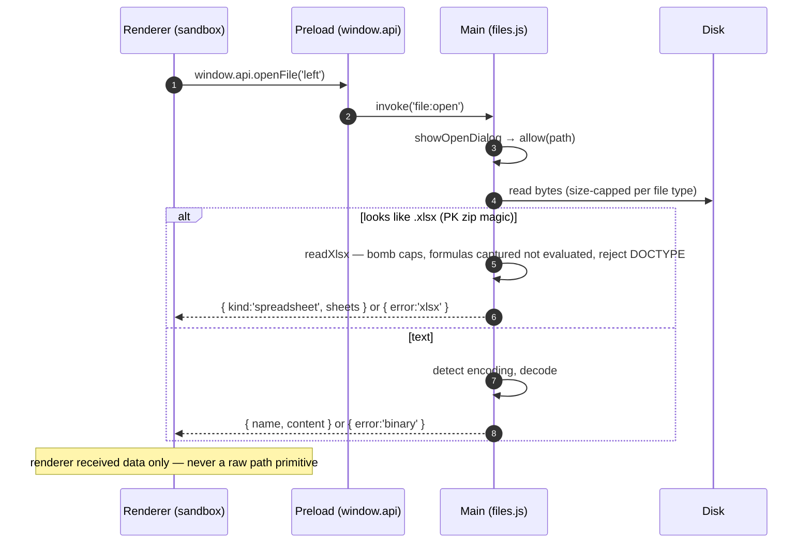
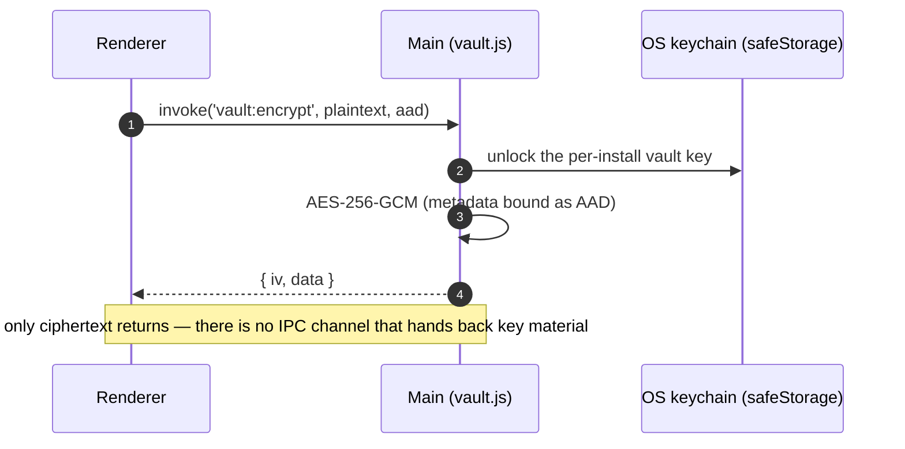
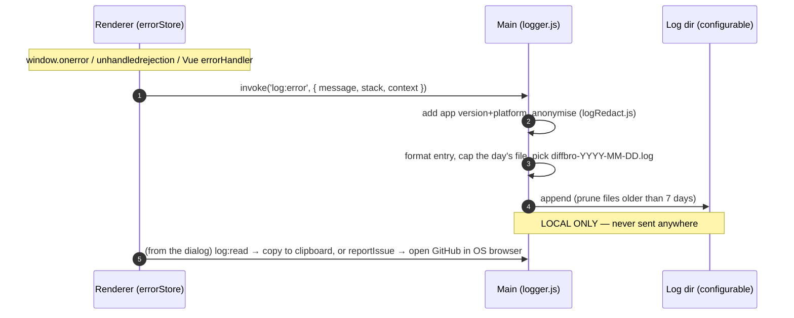

# DiffBro — IPC & security architecture

DiffBro is an **offline-only** desktop app built on Electron. Its whole security
posture rests on one idea: **the renderer (the UI) is treated as hostile.** If a
bug or a malicious diff ever ran code in the renderer, it must not be able to
read your keys, touch arbitrary files, or send anything over the network.

Electron runs two separate OS processes, and everything below is about the wall
between them:

- **Main process** — trusted. Has Node, `fs`, `crypto`, dialogs, the OS
  keychain. All real work happens here.
- **Renderer process** — sandboxed and untrusted. Vue + Pinia only. No Node, no
  Electron, no `fs`, no network.

They cannot call each other's functions directly. They communicate **only** over
**IPC** (Inter-Process Communication) — named message channels — and the renderer
can reach those channels **only** through a tiny, fixed bridge that the preload
script exposes as `window.api`.

---

## The processes and the bridge

Every arrow the renderer participates in goes **through `window.api` → IPC**.
There is no other door.

---

## What is blocked, and where

These are the non-negotiables from [standards.md](standards.md), and the file
that enforces each:

| Guard                                        | What it stops                                                                                                                                                                                                                                                                                                                                               | Where                                               |
| -------------------------------------------- | ----------------------------------------------------------------------------------------------------------------------------------------------------------------------------------------------------------------------------------------------------------------------------------------------------------------------------------------------------------- | --------------------------------------------------- |
| **Sandbox + `contextIsolation`**             | Renderer has no Node/Electron globals; can't `require('fs')`                                                                                                                                                                                                                                                                                                | `window.js` (webPreferences)                        |
| **Network kill switch**                      | `webRequest.onBeforeRequest` cancels every request that isn't `file:`/`blob:`/`data:` (fetch, XHR, images, workers…)                                                                                                                                                                                                                                        | `security.js`                                       |
| **CSP**                                      | `connect-src 'self'`, `object-src 'none'` — second layer against outbound requests                                                                                                                                                                                                                                                                          | renderer CSP meta                                   |
| **Deny-all permission handler**              | `setPermissionRequestHandler` rejects camera, clipboard-read, geolocation, everything                                                                                                                                                                                                                                                                       | `security.js`                                       |
| **`will-navigate` / `setWindowOpenHandler`** | Renderer can't navigate away or open external windows                                                                                                                                                                                                                                                                                                       | `security.js`                                       |
| **Path provenance allowlist**                | `file:read` only serves a path the user actually picked or dropped — not one the renderer invents                                                                                                                                                                                                                                                           | `files.js`                                          |
| **Streamed window bounds**                   | `stream:lines` serves only a session token main issued, for a side and a line range that is validated and **refused** (never clamped) when out of range or wider than the row ceiling; the paths behind a session clear the same `mayReadPath` gate as any other read                                                                                       | `streamedDiff.js`, `streamWindow.js`                |
| **Keys never cross IPC**                     | Vault/identity keys stay behind `safeStorage`; only ciphertext is ever returned                                                                                                                                                                                                                                                                             | `vault.js`, `vaultCrypt.js`                         |
| **Untrusted-input caps**                     | Import files get size caps, shape validation, recomputed fingerprints; `.xlsx` gets decompression-bomb caps, a cell budget, a per-cell formula-length cap and a ceiling on how many cells may carry extras                                                                                                                                                  | `files.js`, `xlsx/*`, `share.js`                    |
| **Export format allowlist**                  | `diff:exportFile` is the ONE place the app writes renderer-supplied text. The extension comes from a fixed table in main keyed by a `format` name, never from the renderer's own string, so no caller can ask for an executable one; the change register additionally defuses fields a spreadsheet would run as formulas (`=`, `+`, `-`, `@`)               | `files.js`, `changeRegister.js`                     |
| **Backup deletion by age, never by name**    | `backup:prune` is the only handler that DELETES. It takes an age in days that must be one of the two the app offers (`PRUNE_DAYS`), never a path or a filename, so the renderer cannot name a file to remove; every candidate comes from `listBackups`, which yields only names that parse as one of ours, so anything else sharing the folder is untouched | `backupRoute.js`, `autoBackup.js`                   |
| **No injection sinks**                       | `v-html`, `eval`, `new Function`, `innerHTML` are ESLint-banned                                                                                                                                                                                                                                                                                             | `eslint.config.mjs`                                 |
| **Capture rect clamped**                     | `image:capture` / `image:appendSlice` screenshot only a region clamped inside the window's own content, never a forged or unbounded one; a stitched export is capped in height so a renderer-driven loop can't exhaust memory, and the bitmap stays in main                                                                                                 | `captureRect.js`, `stitchBitmap.js`, `diffImage.js` |

The renderer **cannot**: read a file by path it made up, obtain a private key,
evaluate a spreadsheet formula, or make a network request. Each of those is
either impossible (no API for it) or actively cancelled.

---

## Representative flows

### 1. Opening a file to diff (incl. `.xlsx`)

The renderer never handles a filesystem path it could forge — main resolves the
path from a real dialog/drop, records it in an allowlist, then reads it.

### 2. Vault crypto — the key never leaves main

Saved diffs are encrypted, but the renderer only ever sees ciphertext. The key
is unlocked from the OS keychain inside main and never crosses the bridge.

### 3. Local error logging (this feature)

Uncaught errors are written to a **local, daily-rotated** file so you can paste
it into a bug report. Nothing is transmitted — that would violate the offline
guarantee. The renderer forwards a small record; main does all the fs work.

Even the "Report on GitHub" action doesn't send anything from the app: it hands
the issue URL to the OS browser (the only outward link) and you submit the form
yourself. `issueUrl.js` owns the **origin and path**; the renderer may pass an
error message for the prefilled title, never a URL. That message is anonymised
by the same `logRedact.js` rules, capped at 120 characters and encoded with
`URLSearchParams`, so it cannot bolt on a `labels=`/`assignees=` parameter or a
fragment. The confirmation dialog shows the address and the prefilled title
before anything opens.

#### Anonymisation happens on the way in

The log is the one artifact a user is invited to copy out, and its directory is
user-chosen — it can be a synced folder. So `logRedact.js` scrubs an entry
**before it is written**, not when it is read: nothing sensitive reaches the file
in the first place. It replaces

| in the entry                                                                | becomes                                                          |
| --------------------------------------------------------------------------- | ---------------------------------------------------------------- |
| the home dir                                                                | `~`                                                              |
| another account's home (`/Users/x`, `/home/x`, `C:\Users\x`)                | `<user>`                                                         |
| a UNC host and share                                                        | `\\<host>\<share>`                                               |
| a path to a document the app opens                                          | `~/…/<file>.xlsx` — extension kept, name and directories dropped |
| a URL's path, query and fragment                                            | `https://host/<path>`                                            |
| an email address / IPv4 address                                             | `<email>` / `<ip>`                                               |
| a 32+ char hex or 40+ char base64 run (fingerprints, digests, wrapped keys) | `<hex:64>` / `<b64:44>`                                          |

Source paths in a stack trace are deliberately left alone (`.js`, `.vue`, … are
not document extensions), so a trace stays readable. Two limits are worth
knowing: base64 containing `/` is only partly caught, and a parser error that
interpolates **file content** into its message cannot be detected by shape — the
field caps in `logFormat.js` bound it, and the user still reads the log before
pasting it.

---

## Why the renderer is untrusted

A diff tool opens files from anywhere and, in future, renders rich content
(Mermaid, spreadsheets). Any of that could carry a payload that executes in the
renderer. By assuming that has already happened, the boundary above means the
worst a compromised renderer can do is misbehave **inside its sandbox** — it
still can't reach your keys, your unrelated files, or the network. That is the
whole point of keeping every privileged capability behind a small, validated set
of IPC handlers.
