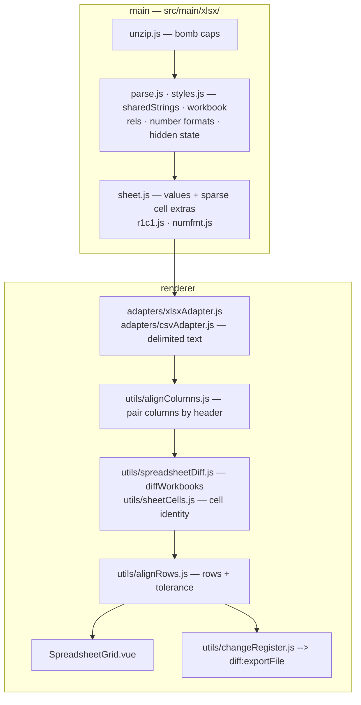
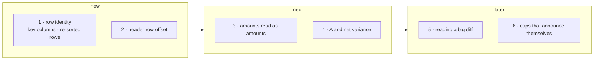
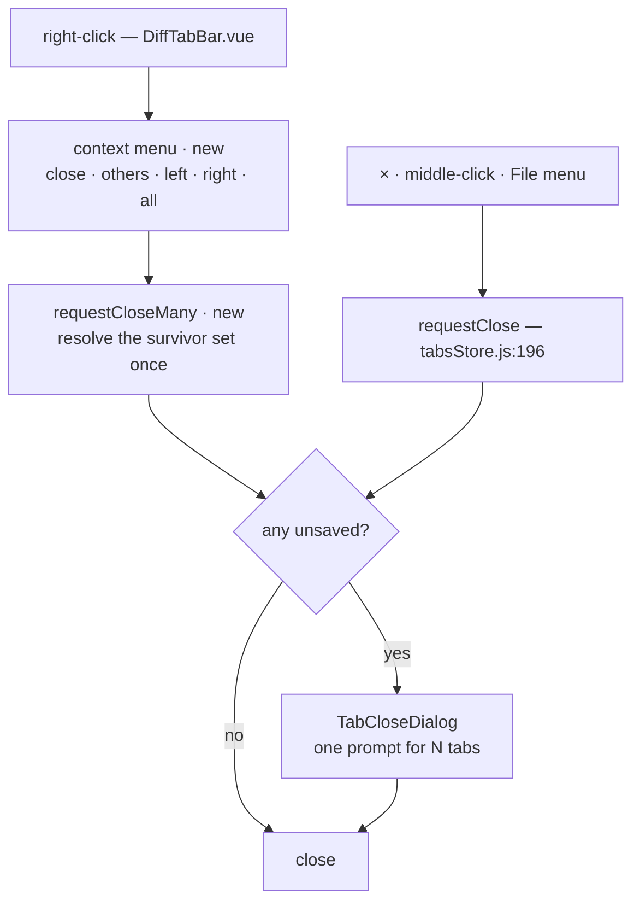
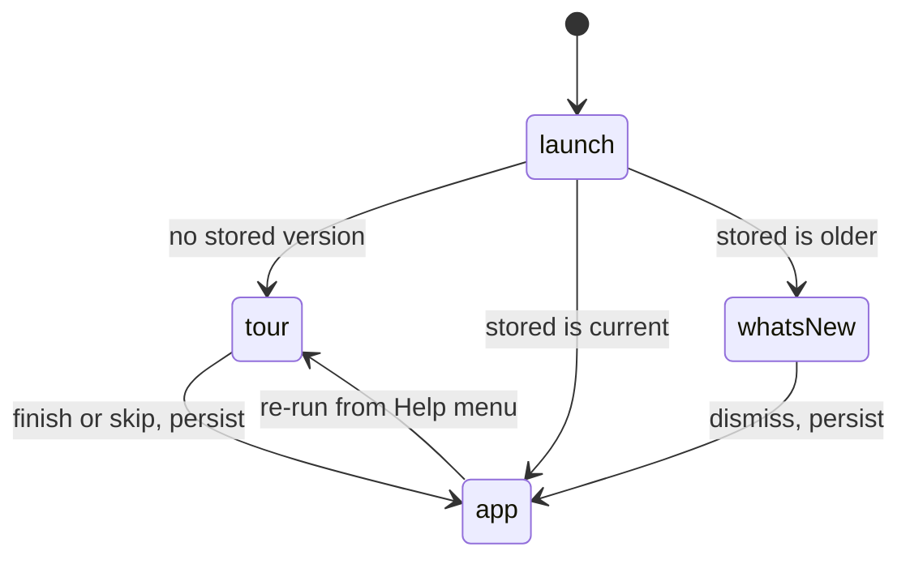

# Roadmap

Board is `docs/brand/roadmap.svg` — hand-authored, edit it alongside the
sections below.

---

## Spreadsheet

**Built** — formulas captured and normalised to R1C1 (`r1c1.js`), number formats
(`numfmt.js`), materiality tolerance, change register, hidden state + error
cells, columns paired by header, `.csv`/`.tsv` through the same grid.

- Capture is not evaluation: nothing in `src/main/xlsx/` computes a formula, and
  the reader still refuses a DOCTYPE and caps every part it inflates

**Reopened.** The track closed against a _model_ diff. Comparing _data_ — a
trial balance, a GL export, a board pack — hits the gaps below.

- **1 · row identity** — `opts.keyColumn` exists (`spreadsheetDiff.js:75`) with
  no UI, takes one column, and rows pair by LCS over row signatures: the same
  export sorted differently reads as 100% changed. Key-based matching,
  composite keys, duplicate-key detection
- **2 · header row offset** — `alignColumns.js:16` reads `rows[0]`. A title row
  above the header fails `usable()` and drops silently to positional pairing,
  which is the failure it was written to prevent
- **3 · amounts read as amounts** — `numfmt.js` renders date, time and percent;
  everything else falls through to the raw float, so a P&L shows `1234567.891`
  and never `(1,234)`. A currency or rounding change is invisible today
- **4 · Δ** — nothing computes the difference. Per cell, net per column, and
  whether both sides still foot — in the grid and in the register
- **5 · reading a big diff** — no changes-only view, no next/prev, no search, no
  "twenty biggest movements". On 40k rows the grid is scroll-and-hope
- **6 · silent caps** — the 400-char formula cap (`sheet.js:11`) makes two long
  formulas sharing a prefix compare EQUAL; `maxMetaCells` (`sheet.js:137`) drops
  formula and format comparison past 100k cells; `csvAdapter` sets `truncated`
  and nothing renders it. A cap that hides is worse than a cap
- **Tolerance** takes a threshold of your own now (`useSpreadsheetDiff.js:7`,
  percentage or raw), but it is still global and still `abs` OR `pct`
  (`alignRows.js:39-40`); materiality is "under €100 AND under 0.5%", per
  column. Date serials are now exempt (`meta.dt` — a percentage of 45870 is
  months), but a bare year in a General-formatted cell still reads as an amount,
  which only per-column thresholds fix

Off the board, unsequenced:

- **structure** — `definedNames` already sit in the parsed `workbook.xml`, and a
  repointed named range rewrites every formula that uses it; hidden COLUMNS go
  unread though rows do not; then merged cells, data validation, conditional
  formatting, comments
- **the deliverable** — a CSV of a workbook diff hands the reader the wrong
  format back (`changeRegister.js --> diff:exportFile`). Wanted, in order of
  value: a highlighted **`.xlsx`** that opens as a workbook with the changed
  cells marked and the register as its own sheet; a **PDF / print** file note —
  title block, totals, the register — that goes into a workpaper unedited; an
  exec summary; a per-change note ("FX revaluation") carried into the export;
  provenance on the register
- **totals that stop agreeing** — the grid has every cell and never checks the
  arithmetic: a sum row that no longer matches its components after the change
  is the single most useful thing a finance reader wants flagged, and it is
  computable from what `spreadsheetDiff.js` already holds
- **statement mode** — match rows by a date+amount key and show only what is
  unmatched, rather than aligning positionally. It is the bank-statement and
  ledger shape, and the same one a household needs for "what is new since last
  month" (`alignRows.js`, `opts.keyColumn`)
- **reconciliation** — many-to-one matching, unmatched on both sides,
  group-by-account rollups. A different engine from row alignment: decide
  whether the track goes there before building toward it
- **compare against the saved copy** — the vault already holds an encrypted
  earlier version of a file; one click to diff what is on disk against it is a
  shorter path than finding the old file (`vaultStore`)
- **order-insensitive text** — the same "identical, differently ordered" problem
  outside structured formats. Specced, semantics undecided:
  `specs/2026-08-02-unordered-text-compare/`
- Still out of scope: pivot tables, charts

---

## Tab management

- `requestClose` is the documented single close guard — a batch routes through
  the same gate, never around it
- `diffStore.pendingTabClose` holds **one** id; a batch prompt needs a set
- `close()` _resets_ the last tab instead of removing it (`tabsStore.js:213`) —
  a naive loop would reset it repeatedly
- In-renderer menu, not a native Electron one: precedent at `SavedDiffs.vue:144`,
  backdrop dismiss at `MenuBar.vue:86` (rule 3)
- Placement, outside-click and Escape go in a composable, unit-tested; flip the
  popup near a viewport edge
- Any shortcut lands in both the hidden app menu and `MenuBar.vue`

---

## Onboarding

- No first-run flag exists in `stores/` or `src/main/`; empty state is inline at
  `App.vue:157-167`
- Store a **version integer**, not a boolean — carries "what's new" with no
  auto-update
- Undiscoverable today: Quick look-up shortcut · Structure toggle · sealed share
- Order: sample comparison first, coach marks for the three above, carousel only
  as fallback
- Scrim from `--shadow-rgb`, never a hardcoded `rgba()` — seven themes are
  light-ground
- E2E: throwaway `--user-data-dir`, assert shown once

---

## Code signing

- The fuse is off _because_ nothing is signed — `electron-builder.yml` header
  documents the dependency
- Notarization is automated by electron-builder; no app change needed
