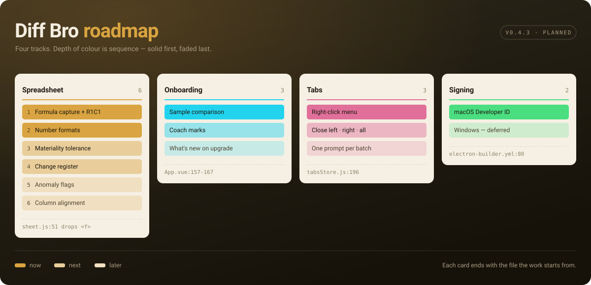
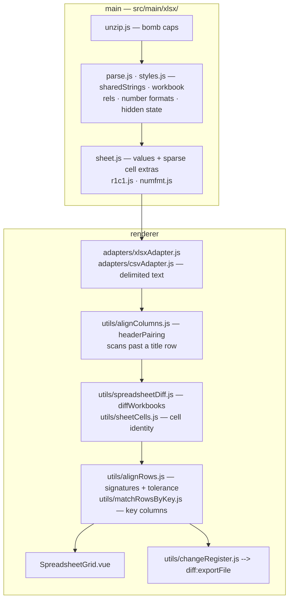
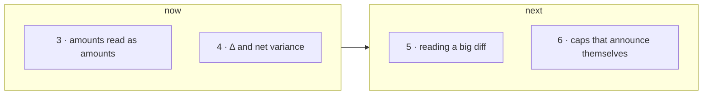
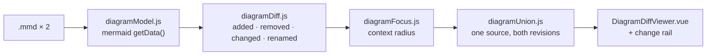
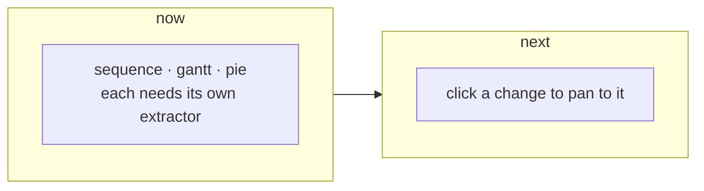
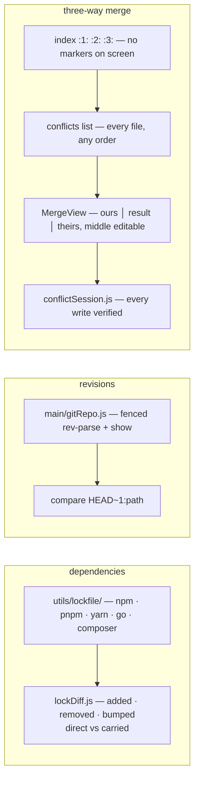
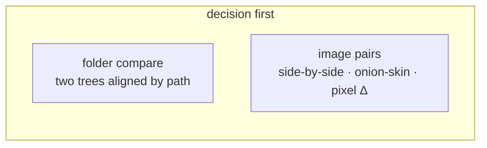
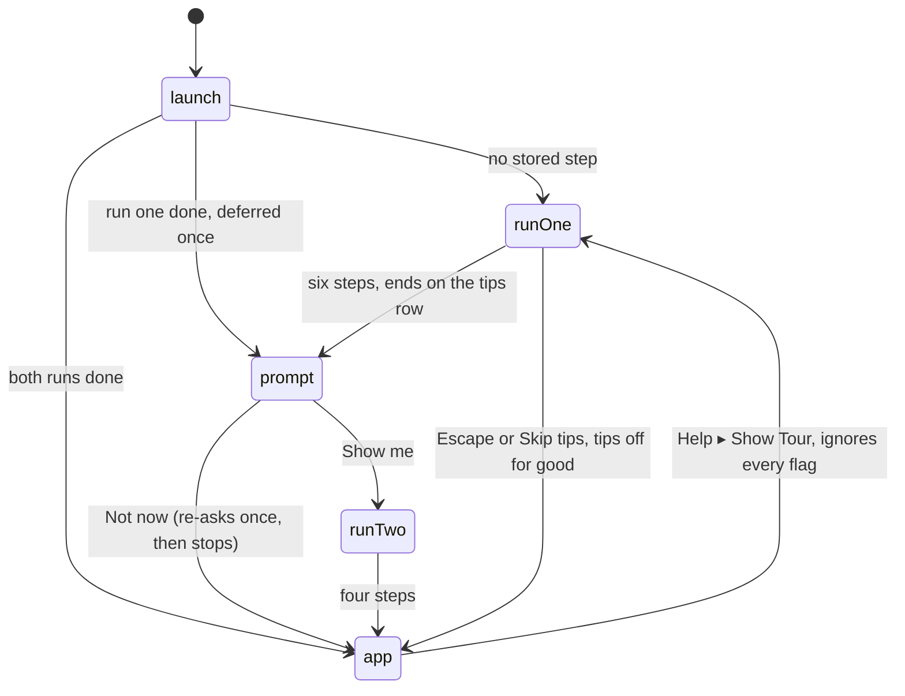
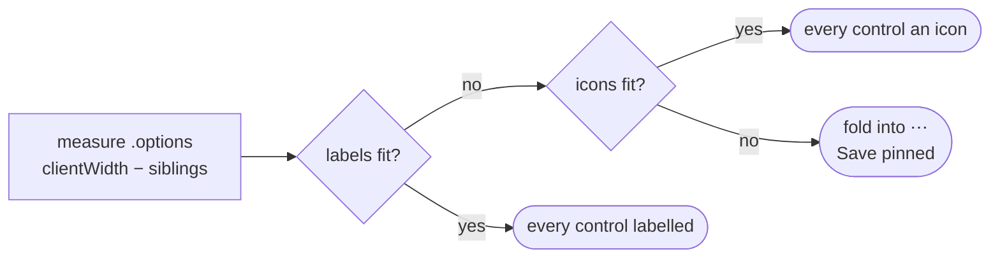
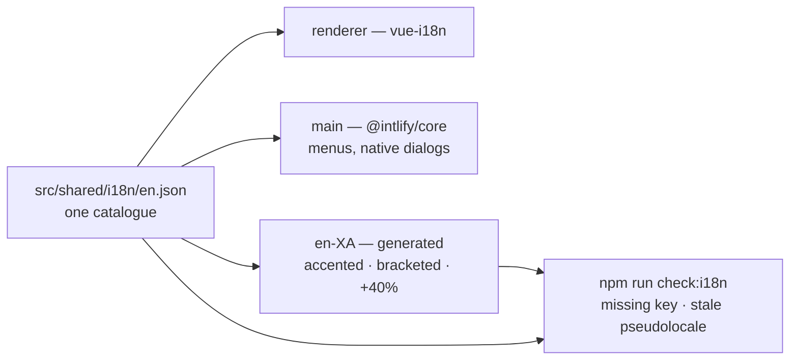

# Roadmap

Board is `docs/brand/roadmap.svg` — hand-authored, edit it alongside the
sections below.

---

## Spreadsheet

**Built** — formulas captured and normalised to R1C1 (`r1c1.js`), number formats
(`numfmt.js`), materiality tolerance, change register, hidden state + error
cells, columns paired by header — found under a title row, not assumed to be
row 1 — rows paired by the columns that name them, `.csv`/`.tsv` through the
same grid.

- Capture is not evaluation: nothing in `src/main/xlsx/` computes a formula, and
  the reader still refuses a DOCTYPE and caps every part it inflates

**Reopened.** The track closed against a _model_ diff. Comparing _data_ — a
trial balance, a GL export, a board pack — hits the gaps below.

**1 · row identity** and **2 · header row offset** are done.

- `matchRowsByKey.js` pairs rows by one column or several, wherever they sit, so
  a re-sorted export reads as the figures that moved. Duplicate keys pair in
  order of occurrence and are COUNTED, never hidden — the panel says so
- `headerPairing` scans for the first row that reads as a header (capped at 10)
  instead of reading `rows[0]` and dropping to positional pairing; the band
  names the row it used when it was not the first
- The hovered row is marked in BOTH grids — they are two `<table>`s, so `:hover`
  in one cannot reach the row aligned with it in the other

**Open.**

- **3 · amounts read as amounts** — `numfmt.js` renders date, time and percent;
  everything else falls through to the raw float, so a P&L shows `1234567.891`
  and never `(1,234)`. A currency or rounding change is invisible today
- **4 · Δ** — nothing computes the difference. Per cell, net per column, and
  whether both sides still foot — in the grid and in the register
- **5 · reading a big diff** — no changes-only view, no next/prev, no search, no
  "twenty biggest movements". On 40k rows the grid is scroll-and-hope
- **6 · silent caps** — the 400-char formula cap (`sheet.js:11`) makes two long
  formulas sharing a prefix compare EQUAL; `maxMetaCells` (`sheet.js:137`) drops
  formula and format comparison past 100k cells; `csvAdapter` sets `truncated`
  and nothing renders it. A cap that hides is worse than a cap
- **Tolerance** takes a threshold of your own now (`useToleranceChoice.js`,
  percentage or raw), but it is still global and still `abs` OR `pct`
  (`alignRows.js:39-40`); materiality is "under €100 AND under 0.5%", per
  column. Date serials are now exempt (`meta.dt` — a percentage of 45870 is
  months), but a bare year in a General-formatted cell still reads as an amount,
  which only per-column thresholds fix

Off the board, unsequenced:

- **structure** — `definedNames` already sit in the parsed `workbook.xml`, and a
  repointed named range rewrites every formula that uses it; hidden COLUMNS go
  unread though rows do not; then merged cells, data validation, conditional
  formatting, comments
- **the deliverable** — a CSV of a workbook diff hands the reader the wrong
  format back (`changeRegister.js --> diff:exportFile`). Wanted, in order of
  value: a highlighted **`.xlsx`** that opens as a workbook with the changed
  cells marked and the register as its own sheet; a **PDF / print** file note —
  title block, totals, the register — that goes into a workpaper unedited; an
  exec summary; a per-change note ("FX revaluation") carried into the export;
  provenance on the register
- **totals that stop agreeing** — the grid has every cell and never checks the
  arithmetic: a sum row that no longer matches its components after the change
  is the single most useful thing a finance reader wants flagged, and it is
  computable from what `spreadsheetDiff.js` already holds
- **statement mode** — match rows by a date+amount key and show only what is
  unmatched, rather than aligning positionally. It is the bank-statement and
  ledger shape, and the same one a household needs for "what is new since last
  month" (`alignRows.js`, `opts.keyColumn`)
- **reconciliation** — many-to-one matching, unmatched on both sides,
  group-by-account rollups. A different engine from row alignment: decide
  whether the track goes there before building toward it
- **compare against the saved copy** — the vault already holds an encrypted
  earlier version of a file; one click to diff what is on disk against it is a
  shorter path than finding the old file (`vaultStore`)
- **order-insensitive text** — the same "identical, differently ordered" problem
  outside structured formats. Specced, semantics undecided:
  `specs/2026-08-02-unordered-text-compare/`
- Still out of scope: pivot tables, charts

---

## Diagrams

**Built** — `.mmd` pairs compare as pictures: both sides parse through mermaid's
own `getData()` (`diagramModel.js`), the graphs diff (`diagramDiff.js`, renames
paired on label), and one union source carrying both revisions renders once
(`diagramUnion.js`) so a single layout means an unchanged node cannot drift.
Focus keeps the changes plus a ring of context and says what it hid
(`diagramFocus.js`). Split view lays the two revisions side by side instead.
The union renders at its own size and the stage pans, zooms and fits around it
(`useZoomPan`) — a 35-node map opens legible instead of shrunk to the pane.

- A `.mmd` pair opens AS a picture — every load path takes the view from the
  files, and a restored snapshot that recorded none does too rather than
  falling back to text (`viewChrome.js` `restoredSemanticView`)
- Status is encoded twice — colour AND stroke pattern — and the three tokens are
  held to a contrast floor and a pairwise ΔE floor on all 20 themes by
  `check-theme-depth.mjs`
- Labels come from the compared files, so the union emitter strips the
  characters that would open a directive or a statement (rule 6)

**Open.**

- **the other diagram types** — `sequence`, `gantt`, `pie`, `journey`,
  `gitGraph`, `mindmap` and the rest expose a bespoke db (`getActors`,
  `getSections`, `getCommits`) with no shared shape, so each is its own
  extractor. They keep the text diff and the toggle stays hidden
- **the register is read-only** — a row names a change you then hunt for by eye;
  clicking one should pan the diagram to it
- Still out of scope: editing a diagram from the diff view

---

## Developer workflow

**Built.** The three artifacts a developer spends the day on, read the way the
rest of the app reads a spreadsheet: as meaning, not as lines.

- **Dependencies** — a lockfile pair reads as the packages that moved and which
  of them you asked for. Nothing is fetched; every fact is in the file
- **Revisions** — `diffbro compare HEAD~1:src/app.js src/app.js`. `git show`
  behind a fence: fixed argv, no shell, the repo root computed in main, hooks
  and the fsmonitor disabled, every inherited `GIT_*` dropped
- **Merge** — `git mergetool` now finishes, and opens on the LIST: every
  conflicted file, what is left and what is done. Take a whole side from a row,
  or open one in the three-pane view — the two branches either side, named by
  branch, and the file you are producing in the middle as a real editor. Sides
  come from the index, so no `<<<<<<<` reaches the screen; a button on each
  pane's inner edge moves that side across, F7 walks the conflicts, and typing
  IS the answer where neither side was right. Files are answered in any order.
  This CROSSES "Diff Bro never writes files", deliberately: the app had already
  registered for the job. The renderer names a row by INDEX and never a path,
  every write is re-verified against git's unmerged list on the way in, and the
  launcher waits so `trustExitCode` is honest

**Open.** TOML lockfiles (`Cargo.lock`, `poetry.lock`) need a parser this repo
does not have. A revision PICKER — the app takes a revision, it is not a git
client. Breaking-change classification for OpenAPI and GraphQL, which is the
same thesis pointed at a contract.

---

## Comparing more

**Open — and gated on a decision, not a build.** Each of these is its own
engine; the track starts by choosing which of them Diff Bro wants to be.

- **folder compare** — two directory trees aligned by relative path, any pair
  drilling into the existing viewers. Needs a recursive-read IPC surface with
  caps (rule 6) before any UI exists
- **image pairs** — the adapter registry already takes a `{ kind }` comparable,
  so the seam exists; which diff to draw (side-by-side, onion-skin, pixel
  delta) is the decision

---

## Onboarding

Done. Anchored coach marks over the real controls, split 6 + 4.

- A step's command fires on NEXT, never on entry: the step points at the
  control, Next performs the action, the step after it lands inside what opened
- Steps name a `data-tour` attribute; the overlay measures it at run time. A
  target that is not on screen still gets its card, centred and ringless — the
  tour must not wedge on a collapsed sidebar or a platform without a menu bar
- Veil is TWO layers: tint is one clipped element, blur is four rectangles —
  `backdrop-filter` resolves before `clip-path`
- Blur, not just scrim: a black scrim moves a dark ground 1.00–1.17× (beacon is
  `#000000`)
- Callout is `--bg-elevated` + `--btn-edge`; the pair swaps roles by ground
- Run two is offered by a dialog immediately, never deferred to a launch that
  may be a month away
- Everything the tour opens leaves with it: the demo's scratch tab, the example
  snippet it saved, the Settings dialog, the editor, the search it typed —
  whether the run finished or was walked out of
- Back steps one at a time. A step has four bookends — `advance` on Next,
  `enter` on arrival, `leave` in either direction, `undo` for Back — so Settings
  closes again rather than covering the control the step returns to
- A step's hole is blocked unless it declares `live`: a click on a file slot
  mid-tour opened a picker over the card that was pointing at it
- Open: the diagram step still points at the Snippets section rather than a
  loaded diagram diff

---

## Toolbar

Done. The four display toggles collapse into one `View` button with a count
chip; the document actions shed in three rungs.

- A control loses its WORD before it loses its PLACE — folding straight from
  labelled to a menu hides something a glyph could still have reached
- The compact width is `--control-h`, never measured: measuring it would mean
  rendering the compact row to decide whether to render it
- Widths are cached per id and read ONLY while the row is labelled — a folded
  control measures 0, a compact one measures `--control-h`, and either would
  overwrite the labelled width the row needs to grow back
- The re-measure signature carries the active locale: a language switch changes
  what every control measures without changing the size of the row, so the
  `ResizeObserver` never fires
- The count chip counts options CHANGED from their default, not options that are
  on — split view and diagram focus both default to on
- `.options` is `flex: 1; min-width: 0` with the auto margin on its first child;
  an end-justified row spills overflow backwards where `scrollWidth` cannot see it

Zoom belongs to the COMPARISON, not to the window.

- `Cmd +/-/0` scale the diff: Monaco's font, the grid, the structural and
  streamed rows. The toolbar, sidebar and menus never move
- Chromium's own zoom is pinned off at the frame — `setVisualZoomLevelLimits(1, 1)`
  plus a `zoom-changed` reset, because pinch and Ctrl+wheel are two more ways in
  besides the accelerators
- A virtualized view zooms its ROW HEIGHT in step with its font, or the spacers
  describe a list of a different size than the one drawn. The grid had
  `height: 24px` in CSS beside a `GRID_ROW_H` of 24 in JS — two copies of one
  fact, true only while nothing moved either

**Open.** `.key-actions` is still `width: var(--sidebar-w)`, so the bar's widest
term is the one the reader drags. Moving it to the sidebar header needs an
unconditional status band first.

---

## Code signing

- The fuse is off _because_ nothing is signed — `electron-builder.yml` header
  documents the dependency
- Notarization is automated by electron-builder; no app change needed

---

## Language

Done. Chrome reads from one catalogue; Settings ▸ Appearance switches it, menus
included, without a restart.

- `utils/` exports key IDs and never calls `t()` — it is pure, and a string
  resolved at module load freezes the locale the app started in
- A sentence wrapping inline markup is ONE `<i18n-t>` message with named slots;
  fragments cannot be reordered by a translator
- Syntax examples (`[text|url]`, `{code}`) never enter the catalogue — vue-i18n
  reads them as plural separators and interpolation

**Open.** No second language ships yet: `en-XA` is a generated pseudolocale for
testing, not a translation. Adding a real locale is a data file plus one row in
`LOCALES`. RTL is untouched — no `dir` handling, no logical-property sweep.
