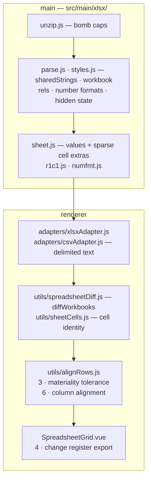
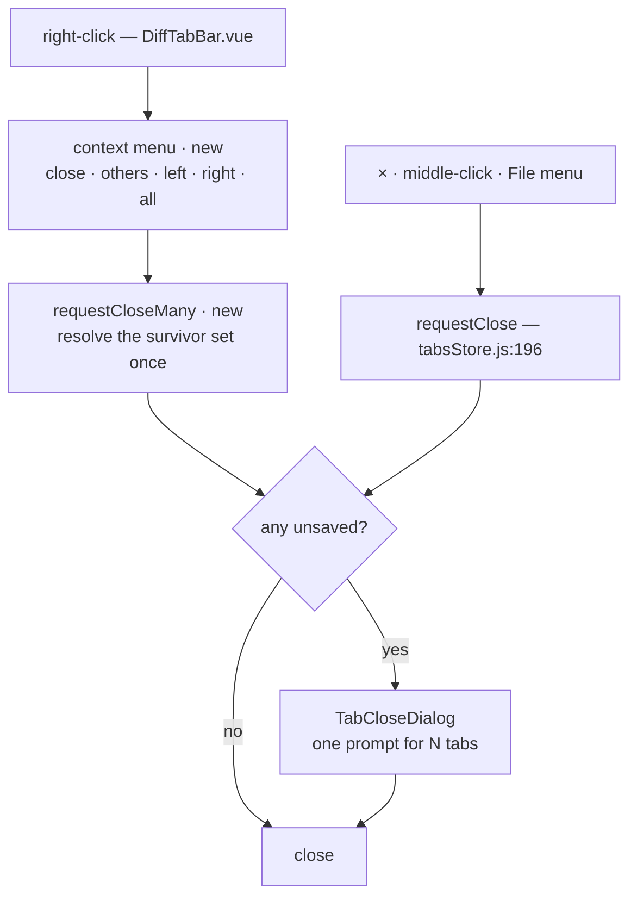
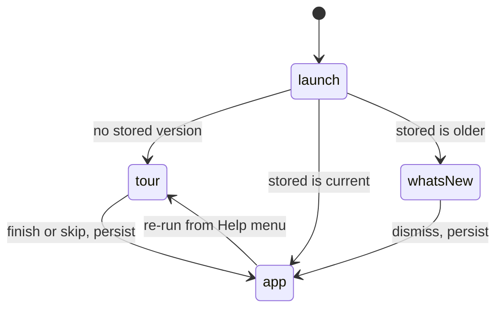
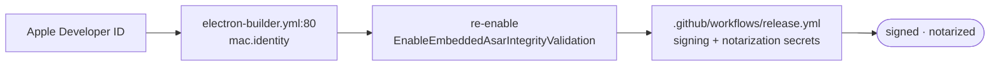

# Roadmap

Board is `docs/brand/roadmap.svg` — hand-authored, edit it alongside the
sections below.

---

## Spreadsheet

**Done.** `<f>` is captured length-capped and normalised to R1C1 (`r1c1.js`), so
a formula replaced by its own cached value is a change and a row insert is not;
a shared formula is expanded onto its followers. `styles.xml` is parsed for
number formats (`numfmt.js`), so a date renders as a date rather than 45870.
Hidden sheets and rows are marked, error cells are compared as errors, and the
grid can show formulas instead of results. Delimited text (`.csv`/`.tsv`) opts
into the same grid through the Structure toggle, which renames itself **Grid**.

**Open.**

- 3 · materiality tolerance — two numbers within a threshold count as equal
- 6 · column alignment — an inserted column should not mark every cell changed
- 4 · change register — the change list as an exportable table
- Capture is not evaluation: nothing in `src/main/xlsx/` computes a formula, and
  the reader still refuses a DOCTYPE and caps every part it inflates
- Out of scope: pivot tables, charts, conditional formatting, cell comments

---

## Tab management

- `requestClose` is the documented single close guard — a batch routes through
  the same gate, never around it
- `diffStore.pendingTabClose` holds **one** id; a batch prompt needs a set
- `close()` _resets_ the last tab instead of removing it (`tabsStore.js:213`) —
  a naive loop would reset it repeatedly
- In-renderer menu, not a native Electron one: precedent at `SavedDiffs.vue:144`,
  backdrop dismiss at `MenuBar.vue:86` (rule 3)
- Placement, outside-click and Escape go in a composable, unit-tested; flip the
  popup near a viewport edge
- Any shortcut lands in both the hidden app menu and `MenuBar.vue`

---

## Onboarding

- No first-run flag exists in `stores/` or `src/main/`; empty state is inline at
  `App.vue:157-167`
- Store a **version integer**, not a boolean — carries "what's new" with no
  auto-update
- Undiscoverable today: Quick look-up shortcut · Structure toggle · sealed share
- Order: sample comparison first, coach marks for the three above, carousel only
  as fallback
- Scrim from `--shadow-rgb`, never a hardcoded `rgba()` — seven themes are
  light-ground
- E2E: throwaway `--user-data-dir`, assert shown once

---

## Code signing

- The fuse is off _because_ nothing is signed — `electron-builder.yml` header
  documents the dependency
- Notarization is automated by electron-builder; no app change needed
