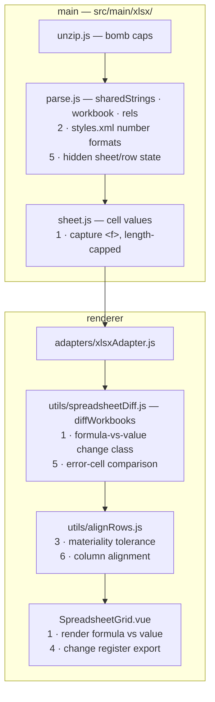
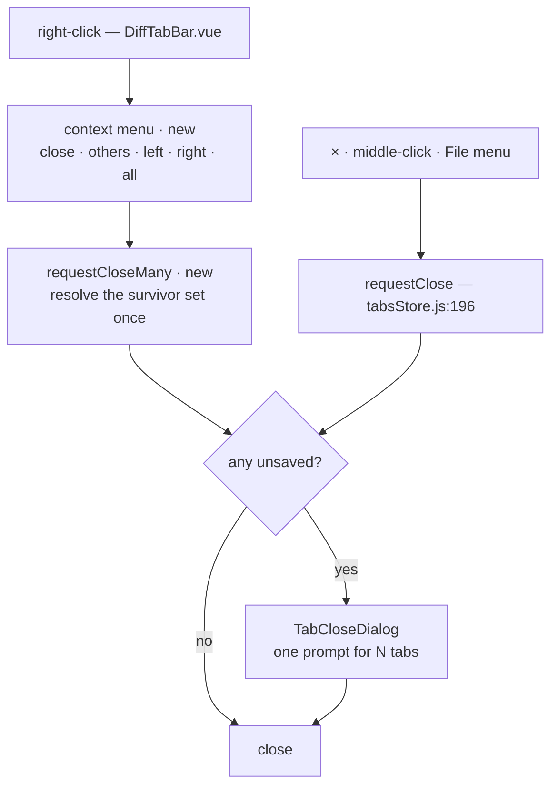
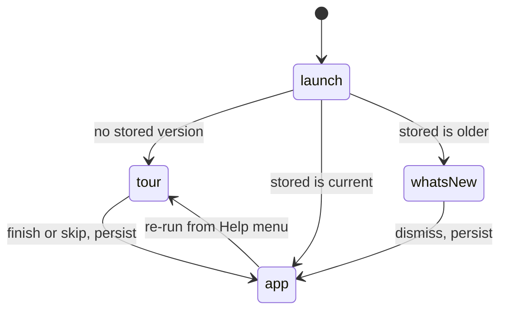

# Roadmap

Board is `docs/brand/roadmap.svg` — hand-authored, edit it alongside the
sections below.

---

## Spreadsheet

- `sheet.js:51` drops `<f>` — a formula replaced by its own cached value reads
  as **unchanged**
- Capture ≠ evaluation; `docs/ipc-security.md` lines 38 · 87 · 112 need updating
- R1C1 normalisation required, or one row insert flags every formula below it
- `styles.xml` skipped → dates render as serial numbers
- Out of scope: pivot tables, charts, conditional formatting, cell comments

---

## Tab management

- `requestClose` is the documented single close guard — a batch routes through
  the same gate, never around it
- `diffStore.pendingTabClose` holds **one** id; a batch prompt needs a set
- `close()` *resets* the last tab instead of removing it (`tabsStore.js:213`) —
  a naive loop would reset it repeatedly
- In-renderer menu, not a native Electron one: precedent at `SavedDiffs.vue:144`,
  backdrop dismiss at `MenuBar.vue:86` (rule 3)
- Placement, outside-click and Escape go in a composable, unit-tested; flip the
  popup near a viewport edge
- Any shortcut lands in both the hidden app menu and `MenuBar.vue`

---

## Onboarding

- No first-run flag exists in `stores/` or `src/main/`; empty state is inline at
  `App.vue:157-167`
- Store a **version integer**, not a boolean — carries "what's new" with no
  auto-update
- Undiscoverable today: Quick look-up shortcut · Structure toggle · sealed share
- Order: sample comparison first, coach marks for the three above, carousel only
  as fallback
- Scrim from `--shadow-rgb`, never a hardcoded `rgba()` — seven themes are
  light-ground
- E2E: throwaway `--user-data-dir`, assert shown once

---

## Code signing

- The fuse is off *because* nothing is signed — `electron-builder.yml` header
  documents the dependency
- Notarization is automated by electron-builder; no app change needed
