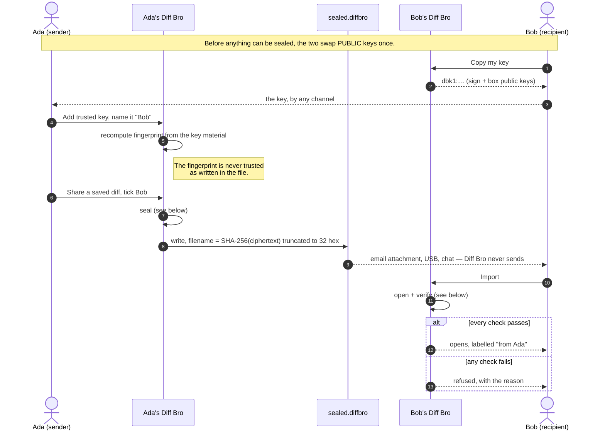
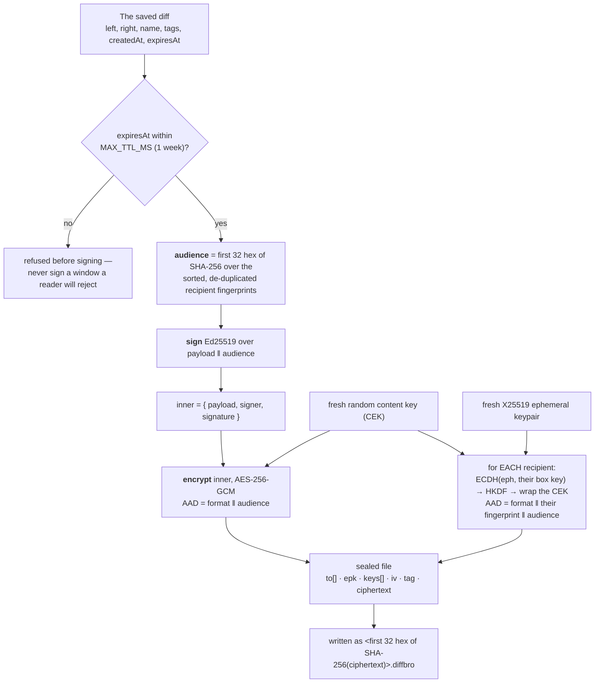
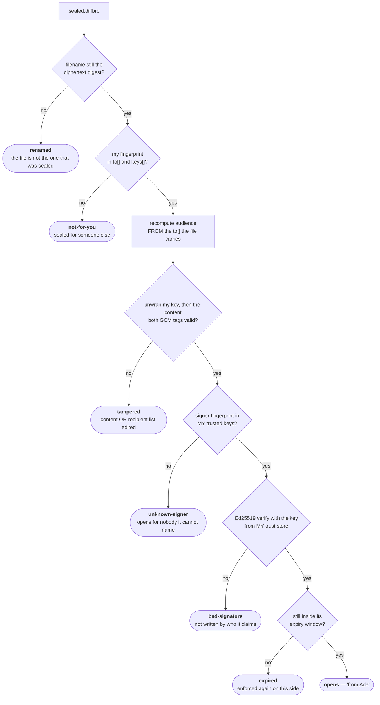
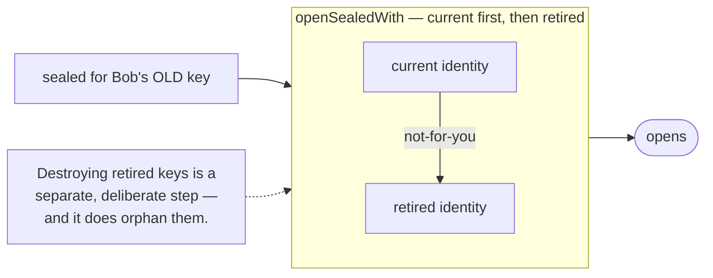

# How a sealed diff travels

What actually happens between "Share as sealed file" and "opened, from Ada" —
and which step catches which kind of tampering.

Source of truth: `src/main/sealing.js` (`sealEntry`, `openSealed`),
`src/main/shareExport.js` (the write), `src/main/share.js` (`openSharedFileAt`).
The invariants below are hard rule 5 in [standards.md](standards.md#hard-security-rules-non-negotiable).

## The exchange

Nothing is sent. Diff Bro writes a file; you move it however you like.

## Sealing — sign, then encrypt

The order matters: the signature is made over the plaintext and then encrypted
with it, so the fact that Ada signed it is not visible to anyone who cannot
already open the file.

**Why the audience is in three places.** It is committed to by the signature,
by the content AAD, and by every wrapped key's AAD. That is what stops a sealed
file being re-addressed: edit `to[]` and all three stop matching at once. A
single recipient is just an audience of one.

## Opening — four independent gates

Bob's app answers a different question at each step, and stops at the first no.

Two details that are easy to get wrong, and are the reason this is written down:

- **The audience is recomputed from the file, never read from it.** If an
  attacker adds their own fingerprint to `to[]`, the recomputed digest changes,
  and both AAD layers fail — so the edit surfaces as `tampered` rather than
  being taken at face value.
- **The verifying key comes from Bob's trust store, not from the file.** The
  file names a signer; Bob looks that fingerprint up locally and verifies with
  the key _he_ holds. A file carrying its own verifying key would let anyone
  claim to be anyone. (`snippetSealing.js` had exactly that bug — see PR #26.)

## What this does and does not promise

|                                  |                                                                                                                    |
| -------------------------------- | ------------------------------------------------------------------------------------------------------------------ |
| A third party cannot read it     | ✅ only a ticked recipient's private key unwraps the content key                                                   |
| Undetected edits                 | ✅ two AES-GCM tags; any change to content or recipients fails one                                                 |
| Undetected re-addressing         | ✅ the audience is bound into the signature and both AAD layers                                                    |
| Undetected forgery of the sender | ✅ verified against the key in _your_ trust store                                                                  |
| A renamed file                   | ✅ refused — the filename IS the ciphertext digest                                                                 |
| Expiry honoured                  | ✅ enforced when sealing and again when opening, capped at one week                                                |
| **Replay**                       | ❌ **by design.** A `.diffbro` can be opened as many times as it is kept. The expiry ceiling IS the replay window. |
| **Recall**                       | ❌ removing a trusted key does not reach a file already on someone's machine                                       |
| **Who else received it**         | ⚠️ `to[]` is readable by anyone holding the file — the recipient set is authenticated, not secret                  |

## After a key rotation

Retired keys **decrypt only**. Rotation must never orphan a diff already in
flight, so every identity this machine has ever held stays in the decrypt set;
nothing is ever signed or sealed with a retired one.

Guarded by `e2e/key-rotation.spec.mjs`, which seals across two profiles, rotates,
and then opens — the only shape that catches a decrypt set losing its retired
keys.
